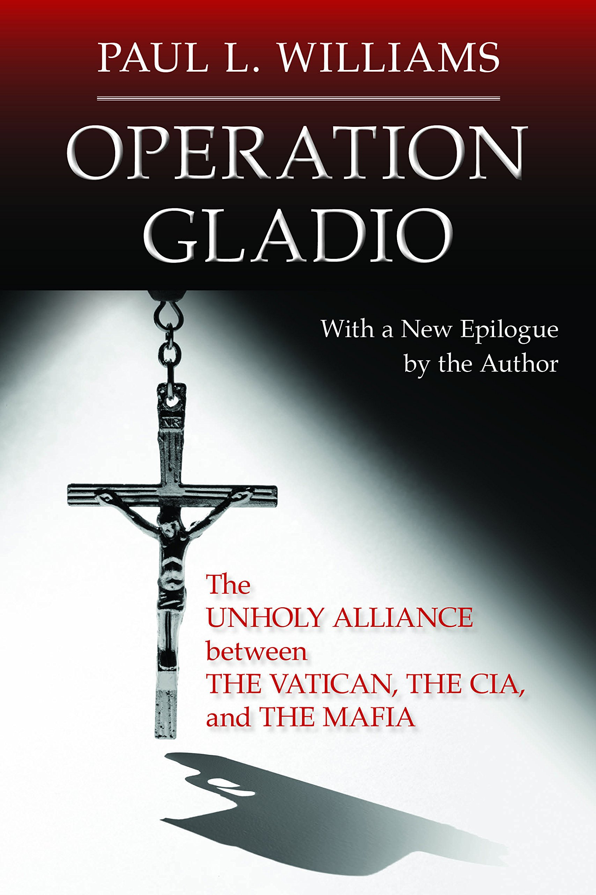

# Operation Gladio: The Unholy Alliance between the Vatican, the CIA, and the Mafia

## Authors

- Paul L. Williams

## About the book

This disturbing expose describes a secret alliance forged at the close of World War II by the CIA, the Sicilian and US mafias, and the Vatican to thwart the possibility of a Communist invasion of Europe. Journalist Paul L. Williams presents evidence suggesting the existence of "stay-behind" units in many European countries consisting of five thousand to fifteen thousand military operatives. According to the author's research, the initial funding for these guerilla armies came from the sale of large stocks of SS morphine that had been smuggled out of Germany and Italy and of bogus British bank notes that had been produced in concentration camps by skilled counterfeiters. As the Cold War intensified, the units were used not only to ward off possible invaders, but also to thwart the rise of left-wing movements in South America and NATO-based countries by terror attacks. Williams argues that Operation Gladio soon gave rise to the toppling of governments, wholesale genocide, the formation of death squads, financial scandals on a grand scale, the creation of the mujahideen, an international narcotics network, and, most recently, the ascendancy of Jorge Mario Bergoglio, a Jesuit cleric with strong ties to Operation Condor (an outgrowth of Gladio in Argentina) as Pope Francis I.Sure to be controversial, Operation Gladio connects the dots in ways the mainstream media often overlooks.

# Highlights

- https://www.corbettreport.com/?s=operation+gladio
- Exposing the Vatican, the CIA and the Mafia connection

## Videos

- https://odysee.com/@corbettreport:0/gladio-revisited:9
- https://odysee.com/@wolfpox:5/operation-gladio!:4
- https://odysee.com/@montysthinkingoutsidethebox:2/991768169_NATOS-Secret-Armies--Operation-Gladio:4
- https://odysee.com/@montysthinkingoutsidethebox:2/785551384_Timewatch-Operation-Gladio-The-Foot-Soldiers:7
- https://odysee.com/@QuantumRhino:9/Operation-Gladio-(1992):d
- https://odysee.com/@Macroaggressions:6/Operation-Gladio-2022-The-Strategy-of-Tension-Final:0

## Video Archives

- [https://s3.wasabisys.com/public-videos/play.html#c=corbettreport/&v=corbettreport/Gladio%20Revisited-bsWHafahbvs](https://s3.wasabisys.com/public-videos/play.html#c=corbettreport/&v=corbettreport/Gladio%20Revisited-bsWHafahbvs)
