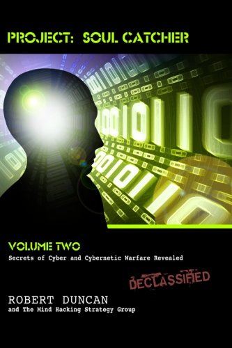

# Project: Soul Catcher: Secrets of Cyber and Cybernetic Warfare Revealed

## Authors

- Robert Duncan
- Mind Hacking Strategy Group

## About the book

Volume 2 details the CIA's practices of interrogation and cybernetic mind control in their pursuit to weaponize neuropsychology. It covers the art of bio-communication war. Human beings are complex machines but their inner workings have been deciphered. Mind control and brainwashing have been perfected in the last 60 years. Hacking computers and hacking into individual minds are similar. The 21st century will be known as the age of spiritual machines and soulless men.

# Highlights

- MK Ultra
- Mind Control
- Targeted Individual
- V2K - Voice to Skull
- Microwave Hearing Effect
- Electronic Harassment
- Electronic Warfare
- Operation Paperclip

## Youtube Videos

- https://www.youtube.com/watch?v=AY0rmINdYIY
- https://www.youtube.com/watch?v=QUXnDbCIW8s
- https://www.youtube.com/watch?v=wZRkfBsTTt8
- https://www.youtube.com/watch?v=62s3FinAoC0

## Video Archives

- https://s3.wasabisys.com/public-videos/play.html#c=Still%20human&v=Still%20human/Dr_Robert_Duncan_Dr_John_Hall_interview_Zeph_Daniel-AY0rmINdYIY
- https://s3.us-east-1.wasabisys.com/public-videos/play.html#v=Officials_say_130_suspected_victims_of_possible_energy_weapon-\[QUXnDbCIW8s\]
- https://s3.us-east-1.wasabisys.com/public-videos/play.html#v=America_s_Book_Of_Secrets_-_DARPA_s_Secret_Mind_Control_Technology_Season_4_History-\[wZRkfBsTTt8\]
- https://s3.us-east-1.wasabisys.com/public-videos/play.html#v=Meet_the_Targeted_Individual_Community-\[62s3FinAoC0\]
